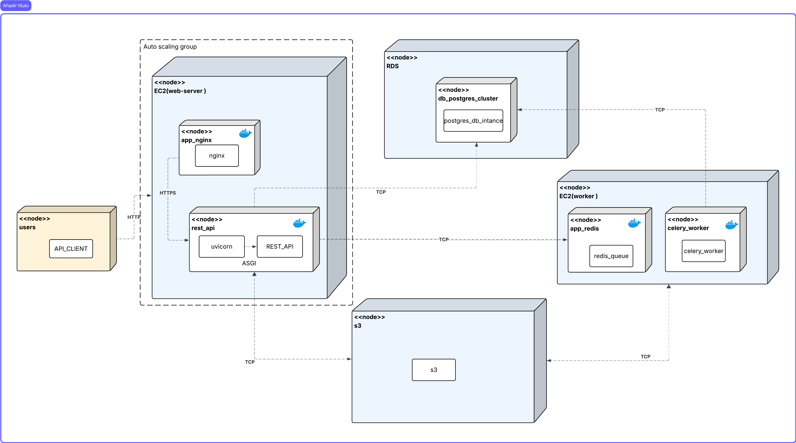
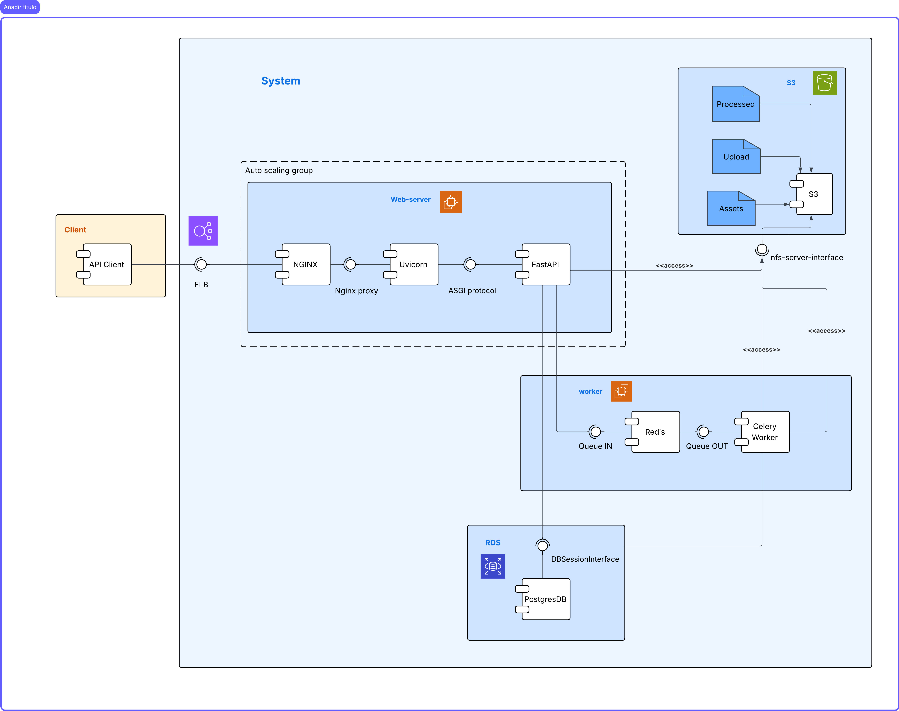

## Entrega 3 – Arquitectura Ajustada (Escalabilidad en la Capa Web)
### Video 
[link video](https://drive.google.com/file/d/15Z4Oqb6sqETkjekoEOlM91yxWHepG3at/view?usp=sharing)
### 1) Resumen
Se incorpora un balanceador de carga (ALB), un grupo de autoescalado (ASG) para la capa web con máximo de 3 instancias, almacenamiento de objetos en Amazon S3 para originales y procesados, y monitoreo en Amazon CloudWatch. La base de datos se ejecuta en Amazon RDS (PostgreSQL); en fases iniciales puede usarse una instancia EC2 y migrar a RDS para pruebas de carga. Se preparan AMIs para la capa web y la capa worker y se registran en grupos de destino del ALB. Para laboratorio se utilizaron instancias t3.micro (sujeto a ajuste dependiendo de la carga).

El health-check del balanceador utiliza el endpoint `/api/health`, el cual responde “ok”:
- Endpoint de salud: `http://ELB-151838069.us-east-1.elb.amazonaws.com:80/api/health`

### 2) Tecnologías y servicios incorporados
- Amazon EC2: ejecución de capa web (Nginx + FastAPI) y capa worker (Celery).
- Amazon ALB (Load Balancer): distribución de tráfico HTTP hacia grupos de destino.
- Amazon Auto Scaling (ASG): escalamiento automático de la capa web (máx. 3 instancias).
- Amazon RDS (PostgreSQL): base de datos relacional administrada.
- Amazon S3: almacenamiento de videos originales y procesados.
- Amazon CloudWatch: métricas, logs y alarmas para escalamiento y observabilidad.
- Nginx: reverse proxy hacia FastAPI y servido de estáticos.
- FastAPI (REST API) y Celery (procesamiento asíncrono).
- Redis: broker/backend de Celery.

### 3) Cambios respecto a la entrega anterior
- Se acopla un ALB delante de la capa web, se crean grupos de destino y health-check por ruta `/api/health`.
- Se define un ASG para la capa web con políticas de escalado automático 
- Se habilita S3 como backend para originales y procesados (sustituyendo NFS para este entorno).
- Se empaquetan AMIs de Web y Worker para arranque homogéneo.
- Se centraliza monitoreo en CloudWatch (métricas de EC2, ALB, RDS y logs de aplicación).

### 4) Modelo de despliegue (Deployment)

Descripción breve:
- Usuarios → ALB (HTTP/HTTPS) → Nginx → FastAPI (capa web).
- FastAPI interactúa con RDS (PostgreSQL) y genera/consume objetos en S3.
- Tareas largas se encolan a Redis y las procesa el/los Worker(s) Celery en EC2.
- CloudWatch centraliza métricas y logs, alarmas disparan políticas de escalamiento en el ASG.
- Para esta entrega solo se hace escalamiento en capa de web

### 5) Modelo de componentes (Component)
Inserte aquí el diagrama de componentes:

Componentes:
- ALB: escucha en :80/443, enruta a Target Group (Nginx/FastAPI).
- Capa Web: Nginx (reverse proxy) + FastAPI (aplicación).
- Capa Worker: Celery ejecutando tareas de procesamiento de video.
- Redis: broker/resultado de Celery.
- RDS (PostgreSQL): persistencia transaccional.
- S3: almacenamiento de originales y procesados.
- CloudWatch: métricas, logs y alarmas.

### 6) Balanceador de carga y health-check
- Target Group Web:
  - Protocolo/puerto: HTTP :80
  - Health check: `/api/health` (200 esperado, JSON con `{"status":"ok"}`)
  - Sticky sessions: deshabilitadas (round-robin)
- Reglas ALB: enrutar `/*` al Target Group Web.

### 7) Autoscaling en la capa web
- ASG Web:
  - Min: 1, Max: 3 instancias.
  - Instancia base (laboratorio): t3.micro (ajustable según resultados).
  - Políticas (sugerido):
    - TargetTracking ALBRequestCountPerTarget (p. ej., 50 req/target).
    - Cooldown/warmup: 60–120 s (ajustar tras pruebas).
  - Alarmas CloudWatch: escalar out/in según umbrales de RPS, latencia p95 o CPU.

### 8) Operación y despliegue
- AMI Web/Worker preparadas con dependencias (Docker, docker-compose, ffmpeg).
- User-data opcional para bootstrap y registro en el ASG.
- Rutas y secretos vía variables de entorno (DB, Redis, S3).

### 9) Observabilidad
- CloudWatch:
  - Dashboards con métricas de ALB (RequestCount, TargetResponseTime).
  - EC2 (CPUUtilization, Network), RDS (CPU, conexiones), logs de aplicación.
- Grafana/Prometheus (opcional) para métricas adicionales si aplica.

### 10) Next steps
- Optimizar política de escalado con resultados de pruebas, junto a la implementacion de ECS (p95, error rate, costos).

