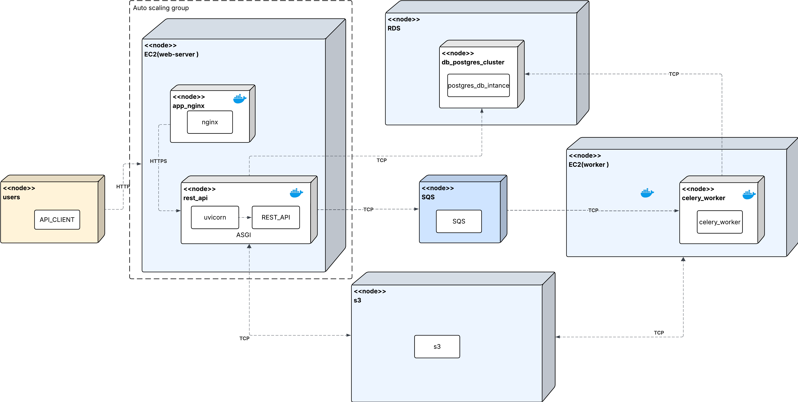
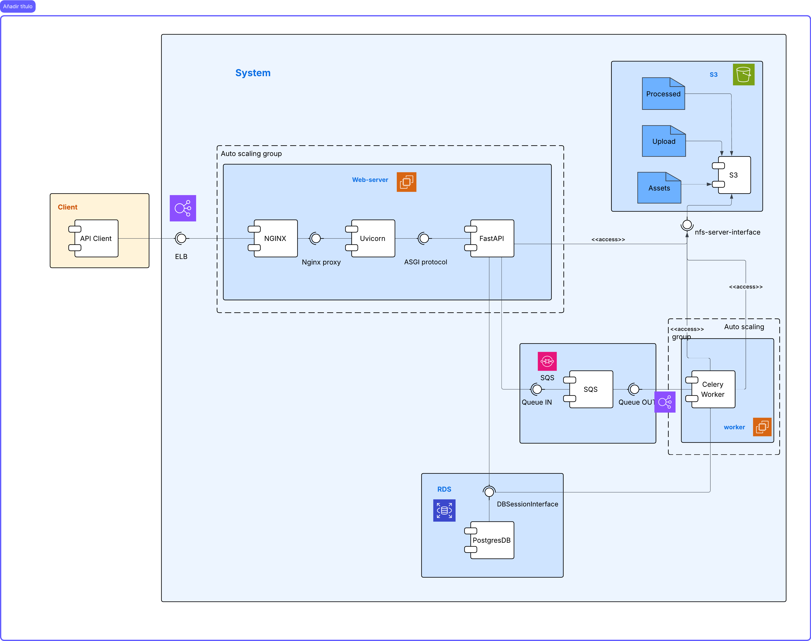

## Entrega 4 – Arquitectura Ajustada (Escalabilidad Web + Workers y Mensajería)

### Video de sustentación

[Link al video](https://drive.google.com/file/d/1j-CGG9F-0TJcAMkxYkkfptpUp249oXOp/view?usp=sharing)

### 1) Resumen ejecutivo

En esta entrega se extiende la arquitectura desarrollada en la entrega 3, incorporando escalabilidad no solo en la capa Web sino también en la capa de procesamiento de video (Workers). Para ello, se adopta **Amazon SQS** como sistema de mensajería asíncrona que desacopla la API REST de los workers de procesamiento.

La solución implementa **alta disponibilidad Multi-AZ** (dos Zonas de Disponibilidad) tanto para el Application Load Balancer (ALB) como para los Auto Scaling Groups de Web y Workers. El almacenamiento de videos originales y procesados permanece en **Amazon S3**, mientras que la base de datos relacional se mantiene en **Amazon RDS (PostgreSQL)**.

Como parte de las decisiones de negocio, se estandarizan las instancias EC2 en tipo **t3.small** (2 vCPU, 2 GiB RAM, 30 GiB almacenamiento) para ambos roles (Web y Worker).

### 2) Tecnologías y servicios incorporados

La arquitectura integra los siguientes componentes tecnológicos:

#### Infraestructura AWS

- **Amazon EC2**: instancias t3.small (2 vCPU, 2 GiB RAM, 30 GiB almacenamiento) para capa Web (Nginx + FastAPI) y capa Worker (Celery).
- **Amazon ALB (Application Load Balancer)**: distribución de tráfico HTTP/HTTPS hacia la capa Web con cross-zone load balancing habilitado.
- **Amazon Auto Scaling Groups (ASG)**: escalamiento automático de Web y Workers (mínimo 1, máximo 3 instancias por grupo).
- **Amazon RDS (PostgreSQL)**: base de datos relacional administrada para persistencia transaccional.
- **Amazon S3**: almacenamiento de objetos para videos originales y procesados.
- **Amazon SQS**: cola de mensajes tipo Standard con Dead Letter Queue (DLQ) para orquestación de trabajos de procesamiento.
- **Amazon CloudWatch**: métricas, logs y alarmas para ALB, EC2, ASG, RDS y SQS.

#### Stack de aplicación

- **Nginx**: reverse proxy hacia FastAPI y servido de contenido estático.
- **FastAPI**: framework para la API REST de la aplicación.
- **Celery**: motor de tareas asíncronas. Broker: SQS. Backend de resultados: Redis.
- **Redis**: backend de resultados de Celery (se mantiene para tracking de estados de tareas).
- **ffmpeg**: herramienta de transcodificación de video en los workers.

### 3) Cambios respecto a la entrega anterior

Esta entrega introduce las siguientes mejoras y modificaciones respecto a la arquitectura de la entrega 3:

#### Arquitectura y escalabilidad

- **Escalado automático de Workers**: se incorporan políticas de Auto Scaling basadas en métricas de SQS (profundidad de cola `ApproximateNumberOfMessagesVisible` y edad del mensaje más antiguo).
- **Mensajería asíncrona con SQS**: se adopta Amazon SQS como broker de Celery, reemplazando a Redis en ese rol. Redis se mantiene exclusivamente como backend de resultados.
- **Despliegue Multi-AZ**: tanto el ASG Web como el ASG Worker se distribuyen en al menos dos subredes privadas de distintas Zonas de Disponibilidad. El ALB opera en subredes públicas de dos AZ.

#### Configuración operativa

- **Health checks y tiempos de escalado**: ajuste de intervalos de health check, warmup y cooldown según los tiempos reales de arranque de la aplicación y de los workers.
- **AMIs consolidadas**: se estandarizan las AMIs de Web y Worker para garantizar un arranque homogéneo en el contexto de ASG Multi-AZ.

#### Variables y parámetros operativos relevantes

**Almacenamiento y base de datos:**
- `STORAGE_BACKEND=s3`
- `DATABASE_URL=postgresql://...`

**Celery y mensajería:**
- `CELERY_BROKER_URL=sqs://` (requiere credenciales AWS y permisos IAM para SQS)
- `CELERY_RESULT_BACKEND=redis://HOST:PORT/DB`

**AWS y SQS:**
- `AWS_REGION`, `AWS_ACCESS_KEY_ID`, `AWS_SECRET_ACCESS_KEY`
- `SQS_QUEUE_NAME`, `SQS_QUEUE_URL`, `SQS_DLQ_ARN`
- `SQS_MAX_RECEIVE_COUNT=5` (reintentos antes de DLQ)
- `SQS_LONG_POLL_SECONDS=20`, `SQS_VISIBILITY_TIMEOUT` (≥ 2× tiempo máximo de tarea)

**Auto Scaling:**
- `ASG_WEB_MIN=1`, `ASG_WEB_MAX=3`
- `ASG_WORKER_MIN=1`, `ASG_WORKER_MAX=3`

**Health checks:**
- `ALB_HEALTHCHECK_PATH=/api/health`
- Intervalos y umbrales ajustados según tiempos de arranque observados

### 4) Modelo de despliegue (Deployment)

A continuación se presenta el diagrama de despliegue de la arquitectura implementada:



#### Flujo de procesamiento

1. **Ingreso de tráfico**: los usuarios acceden al sistema a través del **Application Load Balancer (ALB)** que opera en modo cross-zone sobre subredes públicas de dos Zonas de Disponibilidad.

2. **Capa Web**: el ALB distribuye las peticiones HTTP/HTTPS hacia las instancias del ASG Web, donde **Nginx** actúa como reverse proxy hacia **FastAPI**.

3. **Encolamiento de tareas**: FastAPI persiste los metadatos del video en **Amazon RDS (PostgreSQL)** y publica un mensaje en **Amazon SQS** con la información del trabajo de procesamiento (video_id, S3 key original, transformaciones requeridas).

4. **Procesamiento asíncrono**: los **Workers (Celery)** consumen mensajes de SQS, descargan el archivo original desde **S3**, ejecutan la transcodificación con ffmpeg y cargan el resultado procesado de vuelta a S3 (prefijo `processed/`). Finalmente, actualizan el estado de la tarea en RDS y confirman el mensaje (deleteMessage).

5. **Escalamiento y alta disponibilidad**: tanto el ASG Web como el ASG Worker están distribuidos en dos AZ con configuración mínima de 1 instancia y máxima de 3. **CloudWatch** centraliza métricas, logs y alarmas. **SQS** cuenta con una **Dead Letter Queue (DLQ)** para aislar mensajes con reintentos fallidos.

### 5) Modelo de componentes (Component)

El siguiente diagrama ilustra la estructura de componentes y sus interacciones:



#### Descripción de componentes

- **Application Load Balancer (ALB)**: escucha en puertos :80 (HTTP) y :443 (HTTPS), enruta las peticiones hacia el Target Group Web compuesto por instancias de Nginx/FastAPI.

- **Capa Web**: conformada por **Nginx** (reverse proxy con configuración de health checks y headers `X-Forwarded-*`) y **FastAPI** (API REST que implementa la lógica de negocio).

- **Capa Worker**: procesos **Celery** configurados para consumir mensajes desde SQS, ejecutar transcodificación con ffmpeg y reportar resultados.

- **Amazon SQS**: cola tipo Standard con **Dead Letter Queue (DLQ)** configurada mediante redrive policy (maxReceiveCount=5). Orquesta la comunicación asíncrona entre Web y Workers.

- **Redis**: actúa como backend de resultados de Celery, almacenando estados y metadatos de las tareas en ejecución.

- **Amazon RDS (PostgreSQL)**: base de datos relacional que provee persistencia transaccional para usuarios, videos y estados de procesamiento.

- **Amazon S3**: almacenamiento de objetos para videos originales (prefijo `uploads/`) y procesados (prefijo `processed/`).

- **Amazon CloudWatch**: servicio centralizado para métricas (ALB RequestCount/ResponseTime, EC2/ASG CPU/Network, RDS connections, SQS depth), logs de aplicación y alarmas de escalado.

### 6) Balanceador de carga y alta disponibilidad (Multi-AZ)

La arquitectura implementa alta disponibilidad mediante distribución Multi-AZ de los componentes críticos:

#### Application Load Balancer (ALB)

- **Aprovisionamiento**: el ALB está desplegado en subredes públicas de dos Zonas de Disponibilidad, con **cross-zone load balancing habilitado** para distribución equitativa del tráfico.
  
- **Target Group Web**:
  - **Protocolo y puerto**: HTTP en puerto :80 (o HTTPS :443 cuando se configura terminación SSL en el ALB, con tráfico interno hacia Nginx en :80).
  - **Health check**: endpoint `/api/health` con respuesta esperada HTTP 200 y payload `{"status":"ok"}`. Intervalo configurado en 15–30 segundos según tiempos de warmup observados.
  - **Sticky sessions**: deshabilitadas para favorecer distribución round-robin y facilitar el reemplazo de instancias sin afectar sesiones de usuario.

#### Auto Scaling Group Web

- **Distribución Multi-AZ**: las instancias del ASG Web se distribuyen en subredes privadas de dos Zonas de Disponibilidad, garantizando que ante la caída de una AZ el sistema continúe operando con las instancias de la AZ restante.
- **Balanceo de instancias**: el ASG mantiene un balance de instancias entre las AZ configuradas (best-effort distribution).

### 7) Autoscaling de la capa Web

El Auto Scaling Group de la capa Web (ya implementado en la entrega anterior) cuenta con la siguiente configuración:

#### Configuración del ASG Web

- **Capacidad**: mínimo 1 instancia, máximo 3 instancias.
- **Distribución**: Multi-AZ (dos Zonas de Disponibilidad).

#### Políticas de escalado

- **Target Tracking basada en ALB**: métrica `ALBRequestCountPerTarget` con objetivo de ~50 peticiones por instancia (ajustable según pruebas de carga).
- **Opcional - CPU Utilization**: política adicional basada en utilización de CPU (p95 entre 60–70% sostenido por más de N minutos) para complementar la métrica de ALB.
- **Tiempos de enfriamiento**: cooldown de 60–120 segundos y warmup ajustado tras observar tiempos de arranque reales de la aplicación en pruebas de carga.

### 8) Autoscaling de Workers (nuevo)

La principal innovación de esta entrega es la incorporación de escalado automático para la capa de procesamiento de video (Workers).

#### Configuración del ASG Worker

- **Capacidad**: mínimo 1 instancia, máximo 3 instancias.
- **Distribución**: Multi-AZ (dos Zonas de Disponibilidad) para garantizar disponibilidad del procesamiento ante fallos de una AZ.

#### Métricas de escalado

El escalado de workers se basa en métricas de **Amazon SQS** publicadas en **CloudWatch**:

- **`ApproximateNumberOfMessagesVisible`**: representa la profundidad de la cola (mensajes pendientes de procesamiento). Esta métrica es el principal indicador para decidir cuándo añadir o remover workers.
  - **Umbral de scale-out**: cuando la profundidad supera cierto valor (ajustable, p. ej. 20 mensajes por worker), se lanza una nueva instancia.
  - **Umbral de scale-in**: cuando la profundidad cae por debajo de un umbral bajo durante un período sostenido, se remueven instancias.

- **Opcional - `ApproximateAgeOfOldestMessage`**: complementa la decisión de escalado considerando el tiempo de espera del mensaje más antiguo, útil para evitar SLA violations en procesamiento.

#### Consideraciones de configuración

- **Visibility Timeout**: el valor de `SQS_VISIBILITY_TIMEOUT` debe ser al menos **2× el tiempo máximo esperado de una tarea** para evitar que un mensaje sea re-entregado prematuramente mientras aún está siendo procesado.
  
- **Dead Letter Queue (DLQ)**: configurada con `maxReceiveCount=5`, lo que significa que un mensaje que falle 5 veces será movido automáticamente a la DLQ para análisis posterior, evitando bloqueos en la cola principal.

### 9) Mensajería asíncrona (SQS)

Amazon SQS actúa como el componente central de desacoplamiento entre la capa Web y la capa de procesamiento, permitiendo escalamiento independiente de ambas capas.

#### Configuración de la cola

- **Tipo de cola**: Standard (prioriza alto throughput sobre orden estricto de mensajes).
- **Dead Letter Queue (DLQ)**: configurada mediante redrive policy para capturar mensajes que excedan el número máximo de reintentos (`maxReceiveCount=5`).
- **Long polling**: habilitado con `SQS_LONG_POLL_SECONDS=20` para reducir peticiones vacías y costos.

#### Permisos IAM

Se configuran políticas IAM mínimas para garantizar el principio de privilegio mínimo:

- **Capa Web**: permisos `sqs:SendMessage` sobre la cola principal.
- **Capa Worker**: permisos `sqs:ReceiveMessage`, `sqs:DeleteMessage` y `sqs:ChangeMessageVisibility` sobre la cola principal.

#### Flujo de mensajería

1. **Publicación (Web → SQS)**: cuando un usuario carga un video, FastAPI persiste los metadatos en RDS y publica en SQS un mensaje con el payload:
   ```json
   {
     "video_id": 123,
     "s3_key_original": "uploads/video_123.mp4",
     "transformaciones": ["recorte_30s", "transcodificacion"],
     "usuario_id": 456
   }
   ```

2. **Consumo y procesamiento (Worker)**: el worker Celery recibe el mensaje y lo bloquea mediante visibility timeout, descarga el archivo original desde S3, ejecuta la transcodificación con ffmpeg y sube el resultado a S3 bajo el prefijo `processed/`.

3. **Confirmación o reintento**: si el procesamiento es exitoso, el worker actualiza el estado en RDS y confirma el mensaje (`deleteMessage`). Si falla, el mensaje regresa a la cola tras el visibility timeout y se reintenta hasta alcanzar `maxReceiveCount`, momento en el cual se mueve a la DLQ.

#### Integración con Celery

- **Broker**: `sqs://` mediante las librerías Kombu y boto3.
- **Backend de resultados**: Redis (separado del broker para mantener tracking de estados).
- **Concurrencia**: ajustable por worker según cantidad de vCPU y perfil de I/O de las tareas (típicamente 1–4 procesos concurrentes por instancia t3.small).

### 10) Operación y despliegue

#### Construcción de AMIs

Las Amazon Machine Images (AMIs) de Web y Worker se construyen con todas las dependencias necesarias para minimizar tiempos de arranque:

- **Dependencias incluidas**: Docker, docker-compose, ffmpeg, runtime de Python y librerías del sistema.
- **Homogeneización**: se consolidan AMIs estandarizadas para garantizar arranque predecible en entornos Multi-AZ.

#### Inicialización de instancias

- **User-Data (cloud-init)**: script de inicialización que descarga las variables de entorno, inicia los contenedores Docker y registra la instancia en el Target Group del ASG correspondiente.
- **Gestión de secretos**: variables sensibles (credenciales AWS, connection strings) almacenadas en **AWS Systems Manager Parameter Store** o **AWS Secrets Manager** cuando aplica, inyectadas durante el arranque.

#### Topología de red

- **Subredes públicas**: el ALB se despliega en subredes públicas con Internet Gateway para recibir tráfico externo.
- **Subredes privadas**: las instancias Web y Worker residen en subredes privadas sin acceso directo desde Internet. El tráfico de salida (descarga de dependencias, acceso a S3/SQS/RDS) se enruta vía **NAT Gateway**.

#### Configuración de Nginx

- **Health check**: Nginx expone el endpoint `/api/health` para que el ALB y el ASG validen el estado de las instancias.
- **Headers de forwarding**: configuración de headers `X-Forwarded-For`, `X-Forwarded-Proto` y `X-Forwarded-Host` para preservar información del cliente original tras pasar por el ALB.

### 11) Observabilidad

La arquitectura implementa observabilidad centralizada mediante Amazon CloudWatch y herramientas complementarias:

#### Logs

- **CloudWatch Logs**: los logs de aplicación (FastAPI, Celery, Nginx) se envían a CloudWatch Logs para análisis centralizado, troubleshooting y correlación temporal de eventos.
- **Grupos de logs separados**: se organizan por capa (Web, Worker) y tipo de componente para facilitar búsquedas y filtrado.

#### Métricas

Amazon CloudWatch recopila métricas de los siguientes componentes:

- **ALB**: `RequestCount`, `TargetResponseTime`, `HTTPCode_Target_2XX/4XX/5XX`, `HealthyHostCount`.
- **EC2/ASG**: `CPUUtilization`, `NetworkIn/Out`, `DiskReadOps/WriteOps`.
- **RDS**: `DatabaseConnections`, `ReadLatency`, `WriteLatency`, `FreeStorageSpace`.
- **SQS**: `ApproximateNumberOfMessagesVisible`, `ApproximateAgeOfOldestMessage`, `NumberOfMessagesSent/Received/Deleted`.

#### Visualización y trazas

- **Grafana**: se configura Grafana para visualización avanzada de métricas, dashboards personalizados y trazas de errores clave en tiempo real.
- **Scripts de análisis**: se desarrollaron scripts para el Escenario 2 (medición de throughput de workers) que permiten inyección de tareas, monitoreo y cálculo de métricas de capacidad.

### 12) Pruebas de carga y criterios de escalado

Para validar la arquitectura y ajustar los parámetros de escalado, se ejecutan dos escenarios de pruebas de carga:

#### Escenario 1 – Capa Web

**Objetivos:**
- Determinar el throughput sostenible (RPS) por instancia Web.
- Medir la latencia p95 bajo diferentes niveles de carga.
- Validar el comportamiento del ALB en distribución de tráfico Multi-AZ.

**Herramientas:** Locust (headless o con interfaz web).

#### Escenario 2 – Capa Worker

**Objetivos:**
- Medir throughput de procesamiento de video (videos/min) con diferentes niveles de concurrencia (1, 2, 4 workers por instancia).
- Evaluar profundidad de cola SQS y tiempo de clearing con escalado 1→3 instancias.
- Determinar tiempos medios de servicio (S) por tamaño de archivo.

**Herramientas:** scripts de inyección directa en SQS (`inject_worker_tasks.py`) y análisis de métricas (`compute_worker_metrics.py`).

#### Ajustes post-medición

Con base en los resultados de las pruebas, se ajustan:

- **Umbrales de scale-out/in**: basados en p95 de latencia Web y profundidad promedio de SQS para Workers.
- **Tiempos de warmup/cooldown**: configurados conforme a los tiempos reales de arranque observados en cada capa.
- **Capacidad nominal**: documentación de la capacidad sostenible del sistema para referencia operativa.

Para mayor detalle, consultar el documento [Pruebas de Carga – Entrega 4](pruebas_de_carga_entrega4.md).
