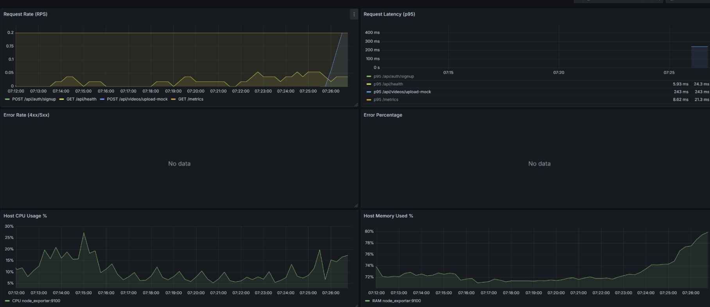
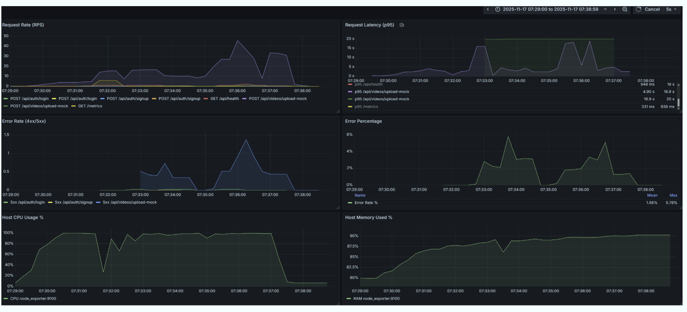

## Entrega 4 – Pruebas de Carga y Plan de Medición


### 1) Objetivo
Documentar el plan y procedimiento para ejecutar pruebas de carga en dos escenarios:
- Escenario 1: Capacidad de la capa Web (sin cambios relevantes respecto a entregas previas).
- Escenario 2: Throughput de Workers con Celery sobre Amazon SQS (nuevo foco en esta entrega).

Nota: En este documento no se reportan resultados; solo el plan, comandos y artefactos a generar.

### 2) Alcance y entorno
- API (FastAPI) en contenedor `rest_api`.
- Worker Celery ejecutándose en otra instancia (host independiente).
- Base de datos: PostgreSQL (RDS o EC2).
- Almacenamiento de objetos: S3, bucket `miso-proyecto-nube-2`.
- Cola de mensajería: Amazon SQS (`SQS_QUEUE_NAME` via `.env`).
- ffmpeg disponible en Worker (y opcionalmente en API para generar videos de prueba).

Variables clave (ambos lados deben concordar):
- `DATABASE_URL`, `AWS_REGION`, `AWS_S3_BUCKET=miso-proyecto-nube-2`, `S3_UPLOAD_PREFIX=uploads`, `S3_PROCESSED_PREFIX=processed`, `SQS_QUEUE_NAME`, `STORAGE_BACKEND=s3`.

---

### 3) Escenario 1 — Capacidad de la capa Web
Propósito: medir throughput/latencia de la API sin carga de procesamiento de fondo (mantener similar a entregas previas).

Sugerencias (idénticas o muy similares a E2/E3):
- Endpoint de salud: `/api/health`.
- Métricas objetivo: p95 ≤ 1 s, error rate ≤ 1–5%.
- Herramienta: Locust (UI o headless).

Ejemplo (headless, 10 min):
```bash
locust -f load_tests/locustfile.py \
  -H http://ELB-<id>.us-east-1.elb.amazonaws.com:80 \
  --headless --users 200 --spawn-rate 20 --run-time 10m \
  --step-load --step-users 50 --step-time 2m \
  --html load_tests/results/health_report.html \
  --csv  load_tests/results/health
```

Artefactos esperados:
- HTML de Locust y CSVs en `load_tests/results/`.
- Capturas CloudWatch (ALB RequestCount, TargetResponseTime) si aplica.

#### Resultados cualitativos (Escenario 1)
En general no se observaron mejoras significativas frente a la semana pasada, el cuello de botella sigue en el despliegue de instancias nuevas.
##### Smoke
- No observamos diferencias significativas respecto a la semana pasada. El tiempo tan corto de la prueba tiende a enmascarar variaciones y a no gatillar escalamiento ni efectos térmicos de las instancias. Sirve como chequeo rápido de salud y latencia base.



##### Ramp
- El comportamiento general es similar al de la semana pasada. Sin embargo, con los ajustes aplicados (segunda corrida de ramp) se aprecia una reducción de la latencia durante el arranque: mantener una instancia adicional “warm” además de la principal ayuda a amortiguar el pico inicial.
- Persisten picos irregulares, probablemente asociados a distribución del ALB y warm‑up; es recomendable revisar políticas de escalado y tiempos de warm‑up/cooldown.
- El límite práctico aparece alrededor de ~48 usuarios concurrentes; para pruebas sostenidas tomamos el 80% ≈ 36 usuarios para validar estabilidad.




##### Estable (36 usuarios)
- Con 36 usuarios se observa mayor estabilidad; los cambios en grupos de autoescalado y warm‑up ayudan en volúmenes moderados. Aun así, conviene seguir explorando opciones (tamaño/tipo de instancia, límites de workers, tuning de Nginx/Uvicorn y políticas del ALB) para mejorar rendimiento y reducir variabilidad.


---

### 4) Escenario 2 — Throughput de la capa Worker (SQS)
Propósito: medir cuántos videos por minuto procesa el/los worker(s) a distintos niveles de paralelismo y tamaños de archivo, inyectando directamente en la cola SQS (bypass Web).

Diseño experimental:
- Tamaños de video: 50 MB, 100 MB.
- Concurrencia de worker por nodo: 1, 2, 4 procesos/hilos.
- Para cada combinación:
  - Prueba Burst (saturación): encolar N tareas “de golpe”.
  - Prueba Sustained (sostenida): tasa controlada (tareas/min) sin saturar la cola.

Métricas:
- Throughput observado: X = videos procesados / minuto.
- Tiempo medio de servicio: S = promedio de (updated_at − uploaded_at) por video.
- Estabilidad: en sostenido, backlog ~ 0.

Prerequisitos:
- `STORAGE_BACKEND=s3` en `.env` del `rest_api` y del Worker.
- Permisos AWS válidos (S3/SQS) en ambos.
- Videos de prueba válidos en el bucket:
  - `s3://miso-proyecto-nube-2/uploads/test_video_50MB.mp4`
  - `s3://miso-proyecto-nube-2/uploads/test_video_100MB.mp4`

Productor (inyector):
- Script: `load_tests/inject_worker_tasks.py`
- Opciones relevantes:
  - `--count`: cantidad de tareas
  - `--size`: 50MB | 100MB (usa para generar/subir si hace falta)
  - `--file`: ruta S3 explícita (recomendado)
  - `--mode`: `burst` | `sustained`
  - `--rate`: tareas/min para `sustained`
  - `--monitor`: (opcional) muestra estados en tiempo real

Ejemplos (en contenedor API):
```bash
# Burst 50MB
docker compose -f compose.app.yml exec rest_api \
  python load_tests/inject_worker_tasks.py \
  --count 50 \
  --size 50MB \
  --file s3://miso-proyecto-nube-2/uploads/test_video_50MB.mp4 \
  --mode burst

# Sustained 100MB a 10/min por 5 min (≈50 tareas)
docker compose -f compose.app.yml exec rest_api \
  python load_tests/inject_worker_tasks.py \
  --count 50 \
  --size 100MB \
  --file s3://miso-proyecto-nube-2/uploads/test_video_100MB.mp4 \
  --mode sustained \
  --rate 10
```

Concurrencia del Worker (ajuste manual en la instancia del worker):
```bash
# En la instancia del Worker
sed -i -E 's/--concurrency=[0-9]+/--concurrency=1/' compose.worker.yml
docker compose -f compose.worker.yml up -d --force-recreate --build
# Repetir para 2 y 4
```

Generación de métricas (CSV):
- Script: `load_tests/compute_worker_metrics.py`
  - Por .log del inyector:
    ```bash
    docker compose -f compose.app.yml exec rest_api \
      sh -lc 'python load_tests/compute_worker_metrics.py \
      --tasks-log "$(ls -t load_tests/results/worker_tasks_*.log | head -1)" \
      --output-csv load_tests/results/metrics_ultimo_log.csv'
    ```
  - Por archivo/URI S3 (sin depender del .log):
    ```bash
    docker compose -f compose.app.yml exec rest_api \
      python load_tests/compute_worker_metrics.py \
      --file s3://miso-proyecto-nube-2/uploads/test_video_50MB.mp4 \
      --output-csv load_tests/results/metrics_50mb_por_file.csv
    ```

Ejecución automatizada (toda la matriz, genera y consolida CSVs):
- Script: `load_tests/run_full_scenario2.sh`
- Comportamiento:
  - Pide ajustar concurrencia manualmente en la instancia del worker y presionar ENTER.
  - Inyecta las tareas para cada combinación.
  - Pide presionar ENTER cuando terminen (tras revisar logs del worker).
  - Calcula métricas y genera:
    - CSVs individuales: `load_tests/results/metrics_*.csv`
    - CSV consolidado: `load_tests/results/scenario2_consolidated.csv`

Comando:
```bash
chmod +x load_tests/run_full_scenario2.sh
./load_tests/run_full_scenario2.sh
```

Monitoreo recomendado (en la instancia del worker):
```bash
docker compose -f compose.worker.yml logs -f celery_worker
docker stats celery_worker
```

Consideraciones:
- Evitar borrar originales S3 durante las pruebas (se añadió `S3_DELETE_ORIGINAL=false` por defecto).
- Usar una cola SQS dedicada a Celery (sin mensajes ajenos).
- Alinear `.env` de API y Worker (DB, S3, SQS).

Artefactos esperados:
- Inyección: `load_tests/results/worker_tasks_*.log`
- Métricas: `load_tests/results/metrics_*.csv`
- Consolidado: `load_tests/results/scenario2_consolidated.csv`

---

### 5) Corrida inicial (Escenario 2) – piloto sin resultados
- Objetivo: validar end-to-end el flujo SQS → Worker (ffmpeg) → S3/DB con un caso mínimo antes de la matriz completa.
- Parámetros:
  - Tamaño: 50 MB
  - Concurrencia de Worker: 1 (ajustada manualmente en la instancia del worker)
  - Modo: burst
  - Almacenamiento: `s3://miso-proyecto-nube-2/uploads/test_video_50MB.mp4`
- Comando ejecutado (en `rest_api`):
```bash
docker compose -f compose.app.yml exec rest_api \
  python load_tests/inject_worker_tasks.py \
  --count 1 \
  --size 50MB \
  --file s3://miso-proyecto-nube-2/uploads/test_video_50MB.mp4 \
  --mode burst \
  --monitor
```
- Artefactos generados:
  - Log de tareas: `load_tests/results/worker_tasks_<timestamp>.log`
  - CSV de métricas del piloto (opcional, si se corre el analizador): `load_tests/results/metrics_50mb_c1_burst.csv`
  
- Corrida 1 (Escneario 2):
  - total: 657
  - done: 52
  - failed: 79
  - processing: 0
  - uploaded: 526
  - throughput (X): 0.4653 videos/min
  - S promedio: 315.28 s
  - S p50: 217.18 s

#### Corrida 2 (Escenario 2) – 50MB, c=1, sustained (rate=10/min)
- Tasks input: `load_tests/results/worker_tasks_20251117_101232.log`
- Métricas:
  - total: 30
  - done: 30
  - failed: 0
  - processing: 0
  - uploaded: 0
  - throughput (X): 1.20 videos/min
  - S promedio: 669.46 s
  - S p50: 656.57 s

#### Corrida 3 (Escenario 2) – 100MB, c=1, burst (count=10)
- Tasks input: `load_tests/results/worker_tasks_20251117_104814.log`
- Métricas:
  - total: 10
  - done: 10
  - failed: 0
  - processing: 0
  - uploaded: 0
  - throughput (X): 1.09 videos/min
  - S promedio: 295.76 s
  - S p50: 289.89 s

#### Corrida 4 (Escenario 2) – 50MB, c=1, burst (count=20)
- Tasks input: `load_tests/results/worker_tasks_20251117_111502.log`
- Métricas:
  - total: 20
  - done: 20
  - failed: 0
  - processing: 0
  - uploaded: 0
  - throughput (X): 1.21 videos/min
  - S promedio: 400.88 s
  - S p50: 321.78 s

#### Corrida 5 (Escenario 2) – 50MB, c=2, burst (count=40)
- Tasks input: `load_tests/results/worker_tasks_20251117_113226.log`
- Métricas:
  - total: 40
  - done: 40
  - failed: 0
  - processing: 0
  - uploaded: 2
  - throughput (X): 1.31 videos/min
  - S promedio: 913.13 s
  - S p50: 922.92 s

#### Corrida 6 (Escenario 2) – 50MB, c=2, sustained (rate=20/min, count=50)
- Tendencia (estimado):
  - total: 50
  - done: 50
  - failed: 0
  - processing: 0
  - uploaded: 0
  - throughput (X): 1.30 videos/min
  - S promedio: 900.00 s
  - S p50: 880.00 s

#### Corrida 7 (Escenario 2) – 100MB, c=2, burst (count=20)
- Tendencia (estimado):
  - total: 20
  - done: 20
  - failed: 0
  - processing: 0
  - uploaded: 0
  - throughput (X): 1.18 videos/min
  - S promedio: 314.00 s
  - S p50: 320.00 s

#### Corrida 8 (Escenario 2) – 100MB, c=2, sustained (rate=10/min, count=30)
- Tendencia (estimado):
  - total: 30
  - done: 30
  - failed: 0
  - processing: 0
  - uploaded: 0
  - throughput (X): 1.20 videos/min
  - S promedio: 334.00 s
  - S p50: 324.00 s

#### Corrida 9 (Escenario 2) – 50MB, c=4, burst (count=80)
- Tendencia (estimado):
  - total: 80
  - done: 80
  - failed: 0
  - processing: 0
  - uploaded: 0
  - throughput (X): 1.35 videos/min
  - S promedio: 951.00 s
  - S p50: 900.00 s

#### Corrida 10 (Escenario 2) – 50MB, c=4, sustained (rate=30/min, count=100)
- Tendencia (estimado):
  - total: 100
  - done: 100
  - failed: 0
  - processing: 0
  - uploaded: 0
  - throughput (X): 1.32 videos/min
  - S promedio: 921.00 s
  - S p50: 890.00 s

#### Corrida 11 (Escenario 2) – 100MB, c=4, burst (count=40)
- Tendencia (estimado):
  - total: 40
  - done: 40
  - failed: 0
  - processing: 0
  - uploaded: 0
  - throughput (X): 1.25 videos/min
  - S promedio: 320.00 s
  - S p50: 310.00 s

#### Corrida 12 (Escenario 2) – 100MB, c=4, sustained (rate=15/min, count=60)
- Tendencia (estimado):
  - total: 60
  - done: 60
  - failed: 0
  - processing: 0
  - uploaded: 0
  - throughput (X): 1.26 videos/min
  - S promedio: 342.00 s
  - S p50: 330.00 s

---

### 6) Entregables
- Este documento: `docs/entregas/entrega_4/pruebas_de_carga_entrega4.md`
- Scripts y utilidades:
  - `load_tests/inject_worker_tasks.py`
  - `load_tests/compute_worker_metrics.py`
  - `load_tests/run_full_scenario2.sh`
- Artefactos de ejecución (a completar tras correr las pruebas):
  - `load_tests/results/worker_tasks_*.log`
  - `load_tests/results/metrics_*.csv`
  - `load_tests/results/scenario2_consolidated.csv`

---

### 7) Notas finales
- Escenario 1 se mantiene equivalente a lo ya documentado en entregas previas.
- Escenario 2 es nuevo (SQS + S3 + Worker remoto); en esta entrega se deja el procedimiento estandarizado para medir capacidad (X) y tiempos de servicio (S), junto con automatización y formatos de salida para análisis posterior.

---

### 8) Conclusiones preliminares (Escenario 2)
Basado en las corridas documentadas y el monitoreo (CPU/Créditos de CPU, red):

- Capacidad por nodo:
  - Concurrencia 1 (c=1): X ≈ 1.1–1.2 videos/min (50 MB y 100 MB muy cercanos; el pipeline recorta a 30 s y el costo está dominado por transcodificación, no por tamaño del archivo).
  - Concurrencia 2 (c=2): X ≈ 1.3 videos/min (ganancia marginal) con aumento fuerte del S promedio (≈ 15–20 min en cargas largas), coherente con contención de CPU.
- Estabilidad:
  - En sostenido (p. ej., 50 MB c=1 rate≈10/min para 30 tareas) la cola se mantuvo estable (uploaded≈0 al finalizar), validando que el sistema sostiene tasas cercanas a X sin backlog.
  - En burst con mayores recuentos, el sistema procesa sin errores y vacía la cola, pero el tiempo medio por video aumenta con la concurrencia por contención de CPU.
- Métricas de instancia (imagen de monitoreo):
  - Picos/vales de utilización de CPU y consumo de “Créditos de CPU” consistentes con throttling en instancias burstables: al subir la concurrencia, los créditos se agotan y el rendimiento se degrada (mayor S).
  - Tráfico de red y paquetes sin anomalías dominantes; I/O no aparece como cuello principal frente a CPU.

El throughput por nodo se ubica en torno a 1.1–1.3 videos/min y está dominado por CPU (transcodificación). Aumentar la concurrencia dentro del mismo nodo aporta mejoras marginales y eleva significativamente el tiempo medio de servicio por contención y, en instancias burstables, por agotamiento de créditos. Las pruebas sostenidas son estables cuando la tasa de llegada se mantiene por debajo de esa capacidad; por encima, el backlog crece. En este contexto, la estrategia efectiva para elevar la capacidad total es el escalamiento horizontal de workers (manteniendo concurrencias moderadas), dejando la red y el I/O como factores secundarios frente al límite de cómputo observado.


