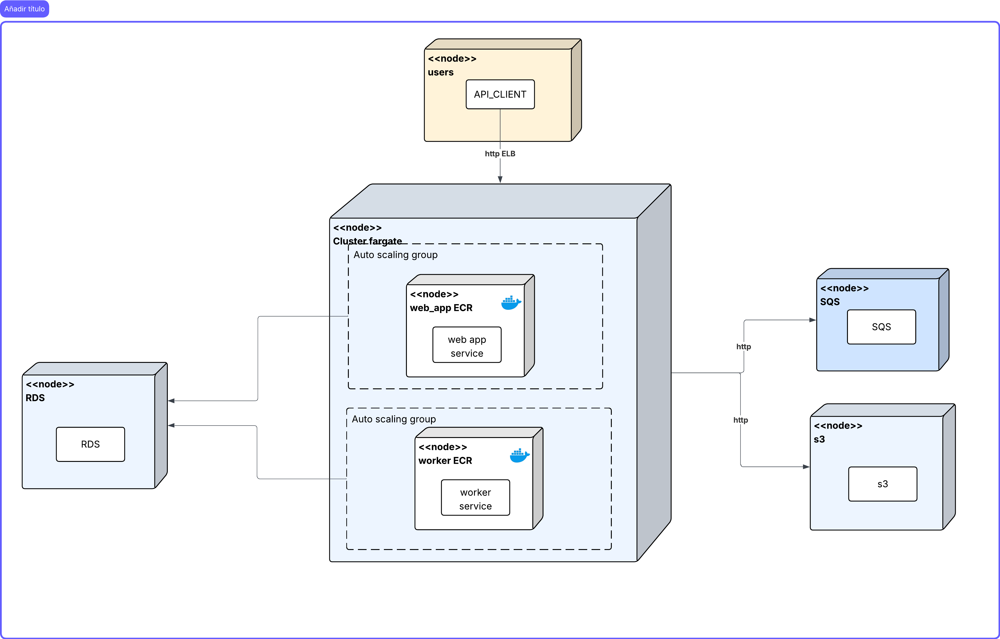
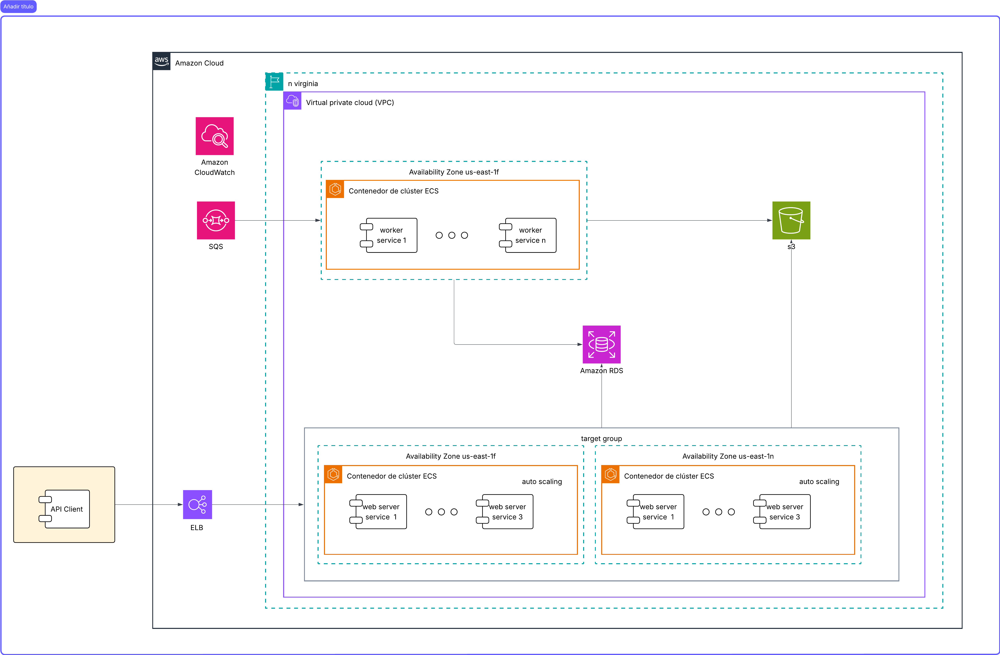

## Entrega 5 – Arquitectura Cloud-Native con ECS Fargate

### Video de sustentación

[Link al video](https://drive.google.com/file/d/1IKU4Gfjc5zkFFzQcFwRadKTNxUUNeMHJ/view?usp=sharing) 

### 1) Resumen 
En esta entrega se migra la arquitectura de EC2 con Auto Scaling Groups a una solución completamente **serverless/container-native** utilizando **Amazon ECS con Fargate**. Esta decisión elimina la gestión de instancias EC2, simplifica el despliegue y reduce el tiempo de escalado (de ~8 minutos en EC2 a segundos en Fargate).

La arquitectura mantiene los componentes de almacenamiento (**Amazon S3**), mensajería (**Amazon SQS**) y base de datos (**Amazon RDS PostgreSQL**), pero reemplaza:

- **EC2 + ASG** → **ECS Fargate Services** con escalado automático
- **AMIs pre-horneadas** → **Imágenes Docker en Amazon ECR**
- **User-data/cloud-init** → **Task Definitions con variables de entorno**

Se implementa alta disponibilidad **Multi-AZ** con el Application Load Balancer (ALB) distribuyendo tráfico hacia el servicio Web, mientras que el servicio Worker consume mensajes de SQS de forma independiente.

### 2) Tecnologías y servicios incorporados

#### Infraestructura AWS

| Servicio | Propósito |
|----------|-----------|
| **Amazon ECS (Fargate)** | Orquestación de contenedores sin gestión de servidores |
| **Amazon ECR** | Registro privado de imágenes Docker |
| **Amazon ALB** | Balanceo de carga HTTP/HTTPS hacia el servicio Web |
| **Amazon RDS (PostgreSQL)** | Base de datos relacional administrada |
| **Amazon S3** | Almacenamiento de videos originales y procesados |
| **Amazon SQS** | Cola de mensajes para orquestación de tareas de procesamiento |
| **Amazon CloudWatch** | Métricas, logs y alarmas para escalado y observabilidad |
| **IAM (LabRole)** | Rol unificado para permisos de ECS, S3, SQS y CloudWatch |

#### Stack de aplicación

- **FastAPI + Gunicorn**: API REST con workers Uvicorn (servicio Web)
- **Celery**: motor de tareas asíncronas con broker SQS (servicio Worker)
- **ffmpeg**: transcodificación de video en los workers
- **boto3**: SDK de AWS para interacción con S3 y SQS

### 3) Cambios respecto a la entrega anterior

| Aspecto | Entrega 4 (EC2 + ASG) | Entrega 5 (ECS Fargate) |
|---------|----------------------|-------------------------|
| **Cómputo** | Instancias EC2 t3.small | Tareas Fargate (vCPU/memoria configurable) |
| **Imágenes** | AMIs pre-horneadas | Docker images en ECR |
| **Tiempo de escalado** | ~8 minutos (bootstrap EC2) | ~30-60 segundos (pull image + start) |
| **Gestión de instancias** | Manual (AMIs, user-data, patches) | Cero (Fargate gestiona todo) |
| **Networking** | Subnets privadas + NAT Gateway | Subnets públicas + assignPublicIp |
| **Configuración** | Variables en user-data/SSM | Variables en Task Definition |
| **Logs** | CloudWatch Agent en EC2 | awslogs driver nativo |
| **Health checks** | ALB → Nginx → FastAPI | ALB → Fargate ENI → Gunicorn |

#### Principales mejoras

1. **Eliminación de Nginx**: Gunicorn expone directamente el puerto 8000; el ALB hace health check directo a `/api/health`.

2. **Imagen Docker unificada**: Una sola imagen sirve para Web y Worker; el comando de inicio diferencia el rol:
   - Web: `/my-app/prestart.sh` (Gunicorn)
   - Worker: `celery -A app.celery_worker.celery_app worker ...`

3. **Escalado más rápido**: Fargate inicia tareas en segundos vs. minutos de bootstrap en EC2.

4. **Simplificación operativa**: Sin AMIs que mantener, sin patches de SO, sin gestión de Docker daemon.

### 4) Modelo de despliegue (Deployment)

#### Flujo de procesamiento

1. **Ingreso de tráfico**: usuarios acceden vía **ALB** (HTTP:80) desplegado en subnets públicas Multi-AZ.

2. **Capa Web (ECS Fargate)**: el ALB enruta al Target Group (target-type: `ip`, puerto 8000). Las tareas Fargate ejecutan **Gunicorn + FastAPI**.

3. **Persistencia y encolamiento**: FastAPI guarda metadatos en **RDS PostgreSQL** y publica mensajes en **SQS** (`cola-nube`).

4. **Procesamiento asíncrono (ECS Fargate)**: el servicio Worker ejecuta tareas **Celery** que:
   - Consumen mensajes de SQS
   - Descargan video original de S3
   - Procesan con ffmpeg (recorte, escalado, watermark, intro/outro)
   - Suben video procesado a S3 (`processed/`)
   - Actualizan estado en RDS

5. **Escalamiento**: Application Auto Scaling ajusta el número de tareas:
   - Web: basado en CPU (target 50%)
   - Worker: basado en profundidad de cola SQS

### 5) Modelo de componentes (Component)


#### Descripción de componentes

| Componente | Descripción |
|------------|-------------|
| **ALB** | Escucha HTTP:80, health check `/api/health`, Target Group tipo `ip` puerto 8000 |
| **ECS Cluster** | Agrupador lógico `proyecto-nube` para servicios y tareas |
| **Service Web** | Mantiene N tareas Fargate con Gunicorn, integrado con ALB |
| **Service Worker** | Mantiene N tareas Fargate con Celery, sin balanceador |
| **Task Definition Web** | Plantilla: imagen, CPU/mem, comando, variables, logs |
| **Task Definition Worker** | Plantilla similar, con comando Celery y más recursos |
| **ECR** | Repositorio `proyecto-nube` con imagen Docker unificada |
| **RDS PostgreSQL** | Base de datos para usuarios, videos y estados |
| **S3** | Bucket `miso-proyecto-nube` con prefijos `uploads/` y `processed/` |
| **SQS** | Cola `cola-nube` con DLQ para mensajes fallidos |
| **CloudWatch** | Logs (`/ecs/proyecto-nube-web`, `/ecs/proyecto-nube-worker`) y métricas |

### 6) Configuración de ECS y Task Definitions

#### Task Definition: Web

```json
{
  "family": "proyecto-nube-web",
  "requiresCompatibilities": ["FARGATE"],
  "networkMode": "awsvpc",
  "cpu": "512",
  "memory": "1024",
  "executionRoleArn": "arn:aws:iam::<ACCOUNT>:role/LabRole",
  "taskRoleArn": "arn:aws:iam::<ACCOUNT>:role/LabRole",
  "containerDefinitions": [{
    "name": "web",
    "image": "<ACCOUNT>.dkr.ecr.us-east-1.amazonaws.com/proyecto-nube:latest",
    "portMappings": [{"containerPort": 8000, "protocol": "tcp"}],
    "command": ["/my-app/prestart.sh"],
    "environment": [
      {"name": "STORAGE_BACKEND", "value": "s3"},
      {"name": "AWS_REGION", "value": "us-east-1"},
      {"name": "AWS_S3_BUCKET", "value": "miso-proyecto-nube"},
      {"name": "SQS_QUEUE_NAME", "value": "cola-nube"},
      {"name": "DATABASE_URL", "value": "postgresql+psycopg2://..."},
      {"name": "SECRET_KEY", "value": "..."}
    ],
    "logConfiguration": {
      "logDriver": "awslogs",
      "options": {
        "awslogs-group": "/ecs/proyecto-nube-web",
        "awslogs-region": "us-east-1",
        "awslogs-stream-prefix": "ecs"
      }
    }
  }]
}
```

#### Task Definition: Worker

```json
{
  "family": "proyecto-nube-worker",
  "requiresCompatibilities": ["FARGATE"],
  "networkMode": "awsvpc",
  "cpu": "2048",
  "memory": "4096",
  "executionRoleArn": "arn:aws:iam::<ACCOUNT>:role/LabRole",
  "taskRoleArn": "arn:aws:iam::<ACCOUNT>:role/LabRole",
  "containerDefinitions": [{
    "name": "worker",
    "image": "<ACCOUNT>.dkr.ecr.us-east-1.amazonaws.com/proyecto-nube:latest",
    "command": ["celery", "-A", "app.celery_worker.celery_app", "worker",
                "--loglevel", "info", "--concurrency", "1", "--prefetch-multiplier", "1"],
    "environment": [
      {"name": "STORAGE_BACKEND", "value": "s3"},
      {"name": "AWS_REGION", "value": "us-east-1"},
      {"name": "AWS_S3_BUCKET", "value": "miso-proyecto-nube"},
      {"name": "SQS_QUEUE_NAME", "value": "cola-nube"},
      {"name": "SQS_VISIBILITY_TIMEOUT", "value": "1500"},
      {"name": "DATABASE_URL", "value": "postgresql+psycopg2://..."},
      {"name": "SECRET_KEY", "value": "..."}
    ],
    "logConfiguration": {
      "logDriver": "awslogs",
      "options": {
        "awslogs-group": "/ecs/proyecto-nube-worker",
        "awslogs-region": "us-east-1",
        "awslogs-stream-prefix": "ecs"
      }
    }
  }]
}
```

### 7) Balanceador de carga y networking

#### Application Load Balancer

| Configuración | Valor |
|---------------|-------|
| Nombre | `alb-proyecto-nube` |
| Scheme | internet-facing |
| Subnets | 2 públicas en AZs distintas |
| Security Group | `sg-alb` (permite 80 desde 0.0.0.0/0) |
| Listener | HTTP:80 → Target Group |

#### Target Group

| Configuración | Valor |
|---------------|-------|
| Nombre | `tg-proyecto-nube` |
| Target type | `ip` (requerido para Fargate awsvpc) |
| Protocol/Port | HTTP:8000 |
| Health check path | `/api/health` |
| Health check matcher | 200 |
| VPC | `vpc-06f03dc840ba4e8f9` |

#### Security Groups

| SG | Inbound | Outbound |
|----|---------|----------|
| `sg-alb` | TCP 80 desde 0.0.0.0/0 | Todo |
| `sg-app` | TCP 8000 desde `sg-alb` | Todo |

#### Networking de tareas Fargate

- **Subnets**: públicas (us-east-1c, us-east-1f)
- **assignPublicIp**: ENABLED (para acceso a S3/SQS sin NAT Gateway)
- **Security Group**: `sg-app`

### 8) Autoscaling

#### Servicio Web (Target Tracking por CPU)
Su politica de escalado corresponde a luego de pasar el 50% de capacidad de su CPU
```bash
aws application-autoscaling register-scalable-target \
  --service-namespace ecs \
  --resource-id service/proyecto-nube/proyecto-nube-web \
  --scalable-dimension ecs:service:DesiredCount \
  --min-capacity 1 --max-capacity 3


aws application-autoscaling put-scaling-policy \
  --service-namespace ecs \
  --resource-id service/proyecto-nube/proyecto-nube-web \
  --scalable-dimension ecs:service:DesiredCount \
  --policy-name web-cpu-50 \
  --policy-type TargetTrackingScaling \
  --target-tracking-scaling-policy-configuration '{
    "TargetValue": 50.0,
    "PredefinedMetricSpecification": {
      "PredefinedMetricType": "ECSServiceAverageCPUUtilization"
    },
    "ScaleInCooldown": 60,
    "ScaleOutCooldown": 60
  }'
```

#### Servicio Worker (Step Scaling por SQS)
Para el servicio de worker esta basado en las peticiones realizada sa este 
```bash

aws application-autoscaling register-scalable-target \
  --service-namespace ecs \
  --resource-id service/proyecto-nube/proyecto-nube-worker \
  --scalable-dimension ecs:service:DesiredCount \
  --min-capacity 1 --max-capacity 4

```

### 9) Observabilidad

#### CloudWatch Logs

| Log Group | Contenido |
|-----------|-----------|
| `/ecs/proyecto-nube-web` | Logs de Gunicorn/FastAPI |
| `/ecs/proyecto-nube-worker` | Logs de Celery/ffmpeg |

#### CloudWatch Metrics

| Namespace | Métricas clave |
|-----------|----------------|
| AWS/ECS | CPUUtilization, MemoryUtilization, RunningTaskCount |
| AWS/ApplicationELB | RequestCount, TargetResponseTime, HealthyHostCount |
| AWS/SQS | ApproximateNumberOfMessagesVisible, NumberOfMessagesReceived |
| AWS/RDS | DatabaseConnections, CPUUtilization |


### 10) Decisiones de arquitectura

| Decisión | Justificación |
|----------|---------------|
| **ECS Fargate vs EC2** | Elimina gestión de instancias, reduce tiempo de escalado de ~8 min a ~30s |
| **Una imagen, dos comandos** | Simplifica CI/CD y garantiza paridad entre Web y Worker |
| **Subnets públicas + assignPublicIp** | Evita costo de NAT Gateway en el lab; en producción usar privadas + NAT |
| **LabRole unificado** | Cumple restricciones del Learner Lab; en producción usar roles específicos |
| **SQS como broker** | Serverless, integración nativa con AWS, métricas para autoscaling |
| **Target type ip** | Requerido para Fargate con awsvpc networking |

### 12) Comparativa de costos (estimado)

| Componente | EC2 (Entrega 4) | Fargate (Entrega 5) |
|------------|-----------------|---------------------|
| Cómputo Web | t3.small × 3 = ~$45/mes | 0.5 vCPU × 3 = ~$30/mes |
| Cómputo Worker | t3.small × 3 = ~$45/mes | 2 vCPU × 4 = ~$120/mes (pico) |
| NAT Gateway | ~$32/mes + data | $0 (IP pública) |
| Gestión | AMIs, patches, monitoring | Cero |

**Nota**: Fargate puede ser más caro en cómputo sostenido pero ahorra en operación y tiempo de escalado.

