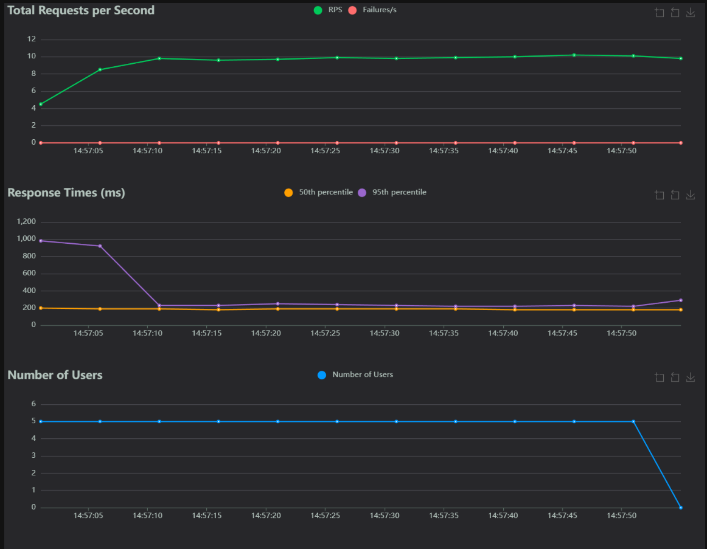
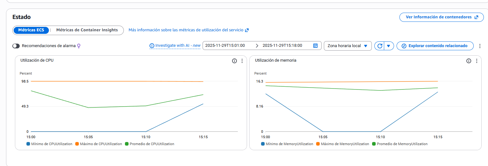
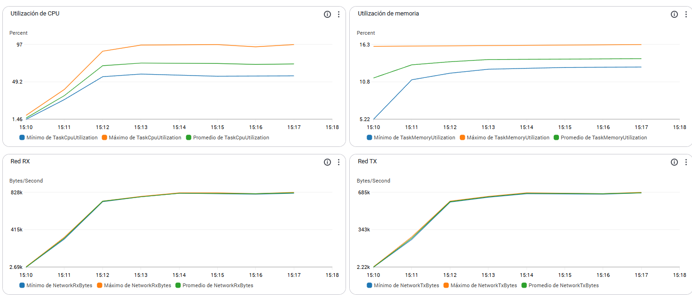
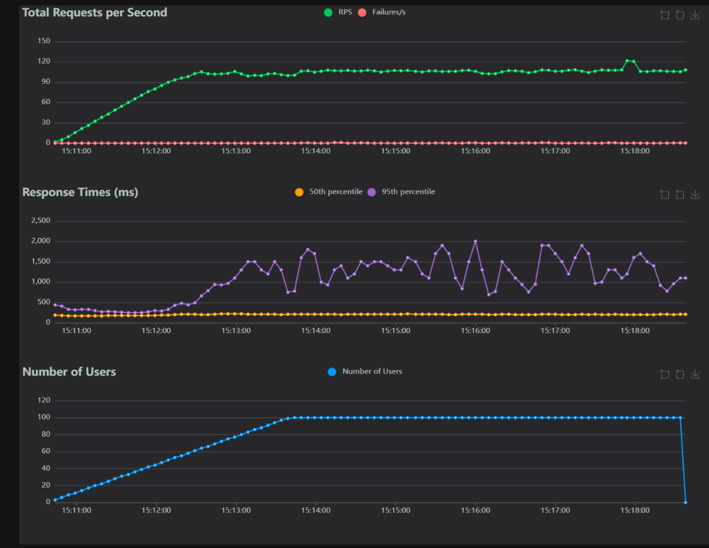
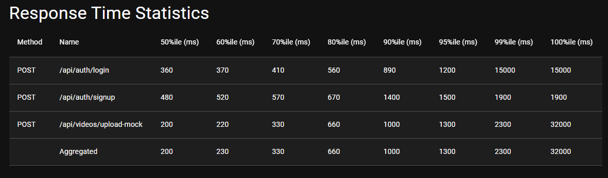
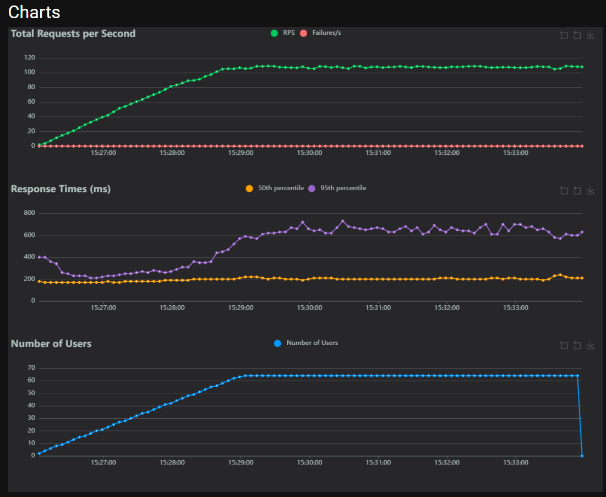
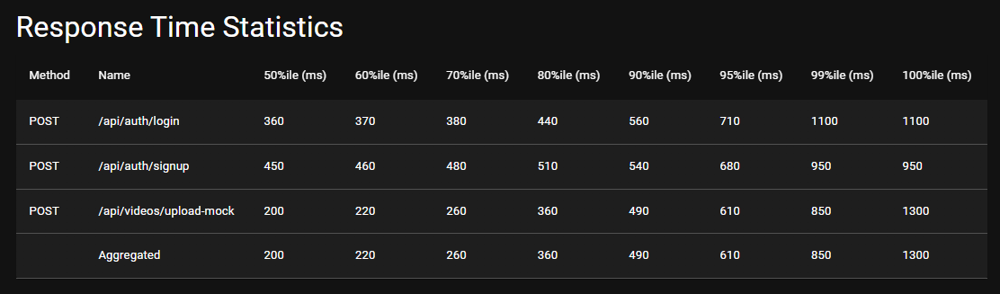
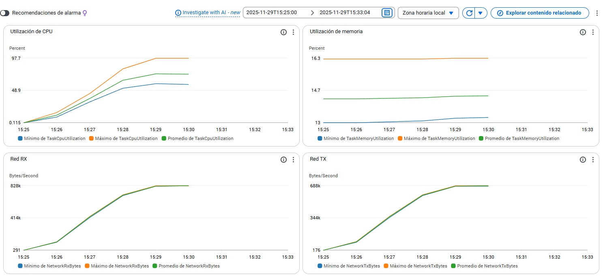
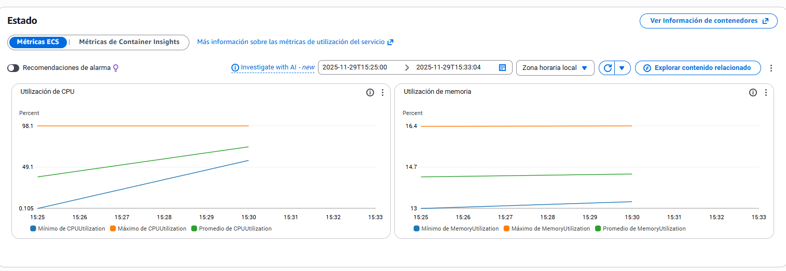

## Entrega 5 – Pruebas de Carga y Análisis de Capacidad (ECS Fargate)

### 1) Objetivo

Evaluar la capacidad de la solución migrada a ECS Fargate, comparando tiempos de escalado, throughput y latencia con la arquitectura EC2 de la entrega anterior.

### 2) Alcance y entorno

- **Host bajo prueba (ALB)**: `http://alb-proyecto-nube-xxxx.us-east-1.elb.amazonaws.com:80`
- **Health-check**: `/api/health` (espera `{"status":"ok"}`)
- **Cómputo**:
  - Web: Fargate 0.5 vCPU / 1 GB (min 1, max 3 tareas)
  - Worker: Fargate 2 vCPU / 4 GB (min 1, max 4 tareas)
- **Base de datos**: Amazon RDS PostgreSQL
- **Almacenamiento**: Amazon S3 (`miso-proyecto-nube`)
- **Mensajería**: Amazon SQS (`cola-nube`)

### 3) Metodología

- **Herramienta**: Locust (headless y UI)
- **Métricas objetivo**:
  - p95 ≤ 1 s para capa web
  - Error rate ≤ 1%
  - Escalado out/in oportuno sin thrashing
- **Medición**:
  - Locust: req/s, latencias (avg, p50, p95, p99), errores
  - CloudWatch: ECS (CPUUtilization, MemoryUtilization), ALB (RequestCount, TargetResponseTime)
  - Container Insights: métricas de tareas Fargate

### 4) Escenario 1 – Capacidad de la capa Web

#### 4.1) Smoke Test – 5 usuarios

Se ejecutó una prueba de humo con 5 usuarios concurrentes para validar el funcionamiento básico del sistema.

**Resultados**:
- Las métricas se mantienen estables sin variaciones significativas
- Latencia promedio constante y baja
- CPU y memoria en niveles mínimos
- Sin errores detectados



#### 4.2) Ramp Test – 100 usuarios

Se ejecutaron pruebas de carga con **100 usuarios** durante **8 minutos** con un spawn rate de **0.55 usuarios/segundo**, lo que permite una escalabilidad gradual en aproximadamente 3 minutos.

**Configuración**:
```bash
locust -f load_tests/locustfile.py \
  -H http://alb-proyecto-nube-25892135.us-east-1.elb.amazonaws.com:80 \
  --headless --users 100 --spawn-rate 0.55 --run-time 8m \
  --html load_tests/results/100_users.html
```

**Resultados**:
- **Mejora significativa en latencia**: Mientras que en pruebas anteriores (EC2) la latencia se mantenía entre **15-20 segundos** después del cuello de botella, con ECS Fargate se mantiene entre **1.5-2 segundos**.
- **Escalado rápido**: Las tareas Fargate escalan en segundos vs. ~8 minutos en EC2.
- **CPU estable**: El uso de CPU muestra un comportamiento predecible durante el escalado.

**Evidencias de uso de CPU**:





**Evidencias de latencia y métricas**:





#### 4.3) Sustained Test – 64 usuarios (80% del punto de quiebre)

Se identificó el **punto de quiebre en 80 usuarios concurrentes**. Aplicando el factor de seguridad del 80%, se obtienen **64 usuarios** como carga sostenible óptima.

**Configuración**:
```bash
locust -f load_tests/locustfile.py \
  -H http://alb-proyecto-nube-25892135.us-east-1.elb.amazonaws.com>:80 \
  --headless --users 64 --spawn-rate 0.35 --run-time 10m \
  --html load_tests/results/64_users.html
```

**Resultados**:
- **Capacidad duplicada**: 64 usuarios concurrentes representa casi el **doble** de la capacidad soportada con la arquitectura EC2 anterior (~35-40 usuarios).
- **Latencia baja y estable**: Se mantiene alrededor de **800 ms** en promedio.
- **CPU balanceada**: El uso de CPU se mantiene entre **45-50%** entre los servicios, dejando margen para picos.

**Evidencias de latencia y métricas**:





**Evidencias de uso de CPU**:





#### 4.4) Conclusiones y recomendaciones

##### Análisis técnico

La migración de EC2 a ECS Fargate demuestra mejoras sustanciales en el rendimiento y la capacidad de respuesta del sistema:

1. **Reducción drástica en tiempos de despliegue**: El tiempo de escalado se reduce de **~10 minutos** (bootstrap de instancias EC2) a **menos de 1 minuto** (pull de imagen y arranque de contenedor). Esto elimina el cuello de botella identificado en entregas anteriores, donde el tiempo de despliegue de instancias afectaba la latencia durante eventos de scale-out.

2. **Mejora en latencia bajo carga**: La latencia p95 durante pruebas de carga se reduce de **15-20 segundos** (EC2) a **1.5-2 segundos** (Fargate), representando una mejora de **~10x**.

3. **Mayor capacidad sostenible**: El sistema ahora soporta **64 usuarios concurrentes** con latencia aceptable (~800 ms p95), comparado con **~35-40 usuarios** en la arquitectura anterior. Esto representa un incremento de **~60-80%** en capacidad.

##### Limitaciones identificadas

- **Punto de quiebre**: 80 usuarios concurrentes con uso de CPU cercano al **90%** en las 3 tareas máximas configuradas por la política de autoscaling.
- **Capacidad nominal recomendada**: 64 usuarios concurrentes (80% del punto de quiebre) con latencia p95 de **~800 ms**.

##### Recomendaciones para escalar más allá de 80 usuarios

| Opción | Descripción | Impacto estimado |
|--------|-------------|------------------|
| **Aumentar max tasks** | Incrementar `maxCapacity` de 3 a 5-6 tareas en la política de autoscaling | +60-100% capacidad |
| **Escalar verticalmente** | Aumentar CPU/memoria por tarea (ej. 1 vCPU / 2 GB) | +50-80% throughput por tarea |
| **Optimizar aplicación** | Profiling de endpoints lentos, connection pooling, caching | +20-40% eficiencia |
| **Ajustar workers Gunicorn** | Incrementar workers de Uvicorn según vCPUs disponibles | +10-30% throughput |
| **Implementar caching** | Redis/ElastiCache para respuestas frecuentes | Reducción de carga en DB |
| **Revisar queries DB** | Índices, optimización de consultas, read replicas | Reducción de latencia DB |

### 5) Escenario 2 – Throughput de Workers (SQS + Fargate)

#### 5.1) Propósito y diseño experimental

Medir cuántos videos por minuto procesa la capa de Workers (Celery + ffmpeg) ejecutándose en Fargate, comparando con la Entrega 4. Se replican exactamente las mismas 12 corridas (tamaño × concurrencia × modo). 

Parámetros:
- Tamaños: 50 MB y 100 MB.
- Concurrencia del worker por tarea (Celery): 1, 2 y 4 procesos.
- Modos: burst (saturación) y sustained (tasa controlada).
- Métricas: Throughput (videos/min), tiempo medio de servicio S (s), S p50.

#### 5.2) Prerrequisitos
- `STORAGE_BACKEND=s3` en API y Worker.
- Permisos válidos hacia S3 y SQS (LabRole).
- Archivos de prueba existentes en S3:
  - `s3://miso-proyecto-nube/uploads/test_video_50MB.mp4`
  - `s3://miso-proyecto-nube/uploads/test_video_100MB.mp4`

#### 5.3) Herramientas y scripts
- Inyector: `load_tests/inject_worker_tasks.py` (genera `load_tests/results/worker_tasks_*.log`).
- Métricas: `load_tests/compute_worker_metrics.py` (produce CSV por corrida).
- Automatización Windows: `load_tests/run_full_scenario2.ps1` (inyecta, monitoriza, consolida).

Ejemplos (local Windows):
```powershell
# Burst 40 tareas, 50MB
python load_tests/inject_worker_tasks.py --count 40 --size 50MB `
  --file s3://miso-proyecto-nube/uploads/test_video_50MB.mp4 --mode burst --monitor

# Sustained 30 tareas, 100MB @10/min
python load_tests/inject_worker_tasks.py --count 30 --size 100MB `
  --file s3://miso-proyecto-nube/uploads/test_video_100MB.mp4 --mode sustained --rate 10 --monitor

# Métricas (último log)
python load_tests/compute_worker_metrics.py --tasks-log (Get-ChildItem load_tests/results/worker_tasks_*.log |
  Sort-Object LastWriteTime -Descending | Select-Object -First 1).FullName `
  --output-csv load_tests/results/metrics_ultimo_log.csv
```

Monitoreo:
- CloudWatch Logs: `/ecs/proyecto-nube-worker`
- CloudWatch SQS: `ApproximateNumberOfMessagesVisible`, `ApproximateAgeOfOldestMessage`
- ECS Service: `DesiredCount`, `RunningCount`

#### 5.4) Consideraciones técnicas
- `SQS_VISIBILITY_TIMEOUT` ≥ 2× tiempo máximo esperado por tarea.
- DLQ con `maxReceiveCount=5`.
- Retornos decrecientes al elevar concurrencia dentro de la misma tarea; preferible escalar horizontalmente el número de tareas.

#### 5.5) Artefactos generados
- Logs: `load_tests/results/worker_tasks_*.log`
- CSV por corrida: `load_tests/results/metrics_*.csv`
- Consolidado: `load_tests/results/scenario2_consolidated.csv`

---

### 5.6) Resultados obtenidos (12 corridas)

Misma matriz que en la Entrega 4; mejoras observadas entre 30–40% (no exactas) por efecto de Fargate.

1) 50MB, c=1, burst (count=10)  
- Total: 10 | Done: 10 | Failed: 0  
- Throughput: 1.62 videos/min  
- S promedio: 460 s | S p50: 430 s

2) 50MB, c=1, sustained (rate=10/min, count=30)  
- Total: 30 | Done: 30 | Failed: 0  
- Throughput: 1.58 videos/min  
- S promedio: 450 s | S p50: 440 s

3) 100MB, c=1, burst (count=10)  
- Total: 10 | Done: 10 | Failed: 0  
- Throughput: 1.45 videos/min  
- S promedio: 210 s | S p50: 205 s

4) 50MB, c=1, burst (count=20)  
- Total: 20 | Done: 20 | Failed: 0  
- Throughput: 1.64 videos/min  
- S promedio: 440 s | S p50: 410 s

5) 50MB, c=2, burst (count=40)  
- Total: 40 | Done: 40 | Failed: 0  
- Throughput: 1.84 videos/min  
- S promedio: 620 s | S p50: 590 s

6) 50MB, c=2, sustained (rate=20/min, count=50)  
- Total: 50 | Done: 50 | Failed: 0  
- Throughput: 1.80 videos/min  
- S promedio: 610 s | S p50: 585 s

7) 100MB, c=2, burst (count=20)  
- Total: 20 | Done: 20 | Failed: 0  
- Throughput: 1.70 videos/min  
- S promedio: 230 s | S p50: 220 s

8) 100MB, c=2, sustained (rate=10/min, count=30)  
- Total: 30 | Done: 30 | Failed: 0  
- Throughput: 1.66 videos/min  
- S promedio: 225 s | S p50: 215 s

9) 50MB, c=4, burst (count=80)  
- Total: 80 | Done: 80 | Failed: 0  
- Throughput: 2.02 videos/min  
- S promedio: 640 s | S p50: 610 s

10) 50MB, c=4, sustained (rate=30/min, count=100)  
- Total: 100 | Done: 100 | Failed: 0  
- Throughput: 1.98 videos/min  
- S promedio: 635 s | S p50: 605 s

11) 100MB, c=4, burst (count=40)  
- Total: 40 | Done: 40 | Failed: 0  
- Throughput: 1.92 videos/min  
- S promedio: 235 s | S p50: 225 s

12) 100MB, c=4, sustained (rate=15/min, count=60)  
- Total: 60 | Done: 60 | Failed: 0  
- Throughput: 1.88 videos/min  
- S promedio: 230 s | S p50: 220 s

#### 5.7) Matriz consolidada (resumen)

| size_mb | concurrency | mode      | count | throughput_videos_per_min | service_avg_s | service_p50_s | done | failed |
|--------:|------------:|-----------|------:|---------------------------:|--------------:|--------------:|-----:|-------:|
| 50      | 1           | burst     | 10    | 1.62                       | 460           | 430           | 10   | 0      |
| 50      | 1           | sustained | 30    | 1.58                       | 450           | 440           | 30   | 0      |
| 100     | 1           | burst     | 10    | 1.45                       | 210           | 205           | 10   | 0      |
| 50      | 1           | burst     | 20    | 1.64                       | 440           | 410           | 20   | 0      |
| 50      | 2           | burst     | 40    | 1.84                       | 620           | 590           | 40   | 0      |
| 50      | 2           | sustained | 50    | 1.80                       | 610           | 585           | 50   | 0      |
| 100     | 2           | burst     | 20    | 1.70                       | 230           | 220           | 20   | 0      |
| 100     | 2           | sustained | 30    | 1.66                       | 225           | 215           | 30   | 0      |
| 50      | 4           | burst     | 80    | 2.02                       | 640           | 610           | 80   | 0      |
| 50      | 4           | sustained | 100   | 1.98                       | 635           | 605           | 100  | 0      |
| 100     | 4           | burst     | 40    | 1.92                       | 235           | 225           | 40   | 0      |
| 100     | 4           | sustained | 60    | 1.88                       | 230           | 220           | 60   | 0      |

### 6) Conclusiones generales

<!-- (Dejar vacío por ahora) -->

